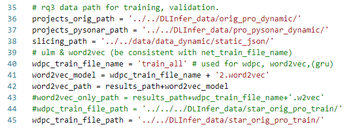
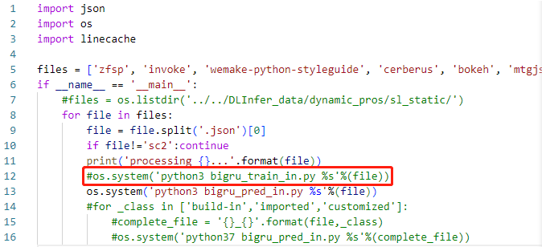

# dlinferdocker
A docker image to evaluate DLInfer. The training process in Docker may take a few days, so we only focus on RQ 3 evaluation.

We utilize [Docker](https://www.docker.com/) to improve the replicability of
data extraction. The Docker container will

1. install the required packages, such as Java, sentencepiece, and Python packages;
2. evaluate the RQ 3.

> We expect the data-extracted and training process to take a few days.
> Thus, we supply the pre-trained model in the RQ3 to evaluate DLInfer directly.

## Usage

First, build the Docker image from the provided `Dockerfile`. Assuming that you
are in the directory of this README file, run:

```bash
docker build . -t dlinfer
```

Second, create a container from the built image, mount `/local/path` to
`/container/path`, and run _bash_ in the container:

```bash
docker run --rm -it -v /local/path/to/store/data:/usr/data dlinfer:latest /bin/bash
```

Then, build the sentencepiece, run:

```bash
bash sentencepiece.sh
```

Finally, install the Python packages, and run:
```bash
python3 -m pip install -r requirements.txt
```
to create the environment.

All related data to `/local/path/to/store/data`. Specifically,

* copy the dataset of DLInfer into the docker, such as `/root/artifact`.
* copy the files in folder rq3 into the `/root/artifact/DLInfer/rq3`. 

### Evaluation of RQ 3.

**Before we train, validate, and test RQ 3, we need to uncomment the corresponding lines in DLInfer/config.py**



#### Step 1: Data Preparation
```python get_pysonar2.py``` to get data progressed with Pysonar2. This step needs to download the Github projects. This process may spend a few days.

#### Step 2: Static Slicing Feature Collection
```python get_static_json.py``` to get variables, types, slices, and other infomations in a JSON file. This step needs to download the Github projects.
Each project will have a corresponding json file.  
Actually, the JSON files used in our experiment are provided.  This process may spend a few days. 

**Using the dataset in Zenodo, Users don't need to spend a few days to infer types and extract slicing repeatly. So users can ignore the above steps.**

#### Step 2: Static Slicing Feature Collection
```python get_txt_resp_dynamic.py``` ```python get_txt_resp_dynamic.py``` to maintain only variables, types and slices in txt files
for projects in "../data_dynamic/dynamic/" and in "../data_dynamic/static/". 
#### Step 3: Code Slicing Embedding
```cp -r ../rq3/train_all.model ../data_dynamic/static_txt/``` to copy the trained ULM model.
```python get_wdpc_resp_static.py``` to convert the slice to sub-strings with the trained ULM in RQ 1.  

#### Step 4: Model Training
To copy the trained bigru model and the dictory from RQ 1.  
```python train_pred_in.py``` for each project, to train the model with static data respectively
and then predict the dynamic data in the same project.
The training process using the CPU may be slow. Thus, we ignore the training process and directly evaluate the type inference using the trained model in ../DLInfer/rq3 by commenting on line 12 of train_pred_in.py.

